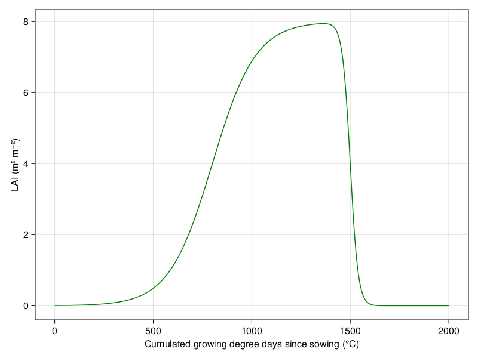

# PlantSimEngine

[](https://VirtualPlantLab.github.io/PlantSimEngine.jl/stable)
[](https://VirtualPlantLab.github.io/PlantSimEngine.jl/dev)
[](https://github.com/VirtualPlantLab/PlantSimEngine.jl/actions/workflows/CI.yml?query=branch%3Amain)
[](https://codecov.io/gh/VirtualPlantLab/PlantSimEngine.jl)
[](https://github.com/SciML/ColPrac)
[](https://github.com/JuliaTesting/Aqua.jl)
[](https://zenodo.org/badge/latestdoi/571659510)
[](https://joss.theoj.org/papers/137e3e6c2ddc349bec39e06bb04e4e09)


## Overview

`PlantSimEngine` is a modelling framework for simulating and modelling plants, soil and atmosphere. It provides tools to **prototype, evaluate, test, and deploy** plant/crop models at any scale, with a strong emphasis on performance and efficiency.

**Key Features:**

- Process Definition: Easily define new processes such as light interception, photosynthesis, growth, soil water transfer, and more.
- Interactive Prototyping: Fast and interactive prototyping of models with built-in constraints to avoid errors and sensible defaults to streamline the model writing process.
- Control Degrees of Freedom: Fix variables, pass measurements, or use simpler models for specific processes to reduce complexity.
- Automatic Management: The package automatically manages input and output variables, time-steps, objects, and the coupling of models using a dependency graph.
- Flexible Model Switching: Switch between models without changing any code, using a simple syntax to specify the model for a given process.
- Integrated Data Use: Force variables to take measured values instead of model predictions, reducing degrees of freedom during model development and increasing accuracy during production mode.
- High-Performance Computation: Achieve high-speed computations, with benchmarks showing operations in the 100th of nanoseconds range for complex models (see this [benchmark script](https://github.com/VirtualPlantLab/PlantSimEngine.jl/blob/main/examples/benchmark.jl)).
- Parallel and Distributed Computing: Out-of-the-box support for sequential, multi-threaded, or distributed computations over objects, time-steps, and independent processes, thanks to [Floops.jl](https://juliafolds.github.io/FLoops.jl/stable/).
- Scalability: Scale easily with methods for computing over objects, time-steps, and [Multi-Scale Tree Graphs](https://github.com/VEZY/MultiScaleTreeGraph.jl).
- Composability: Use any types as inputs, including [Unitful](https://github.com/PainterQubits/Unitful.jl) for unit propagation and [MonteCarloMeasurements.jl](https://github.com/baggepinnen/MonteCarloMeasurements.jl) for propagating measurement error.

**Benefits:**

Improved Accuracy and Reliability:

- Enhance the accuracy of plant growth and yield predictions by integrating detailed physiological processes and environmental interactions.
- Reduced Modeling Time: Streamline the modeling process with automated management and fast prototyping capabilities.
- Collaborative Research: Facilitate collaborative research efforts with flexible and composable modeling tools.

## Installation

To install the package, enter the Julia package manager mode by pressing `]` in the REPL, and execute the following command:

```julia
add PlantSimEngine
```

To use the package, execute this command from the Julia REPL:

```julia
using PlantSimEngine
```

## Example usage

The package is designed to be easy to use, and to help users avoid errors when implementing, coupling and simulating models.

### Simple example 

Here's a simple example of a model that simulates the growth of a plant, using a simple exponential growth model:

```julia
# ] add PlantSimEngine
using PlantSimEngine

# Include the model definition from the examples sub-module:
using PlantSimEngine.Examples

# Define the model:
model = ModelList(
    ToyLAIModel(),
    status=(TT_cu=1.0:2000.0,), # Pass the cumulated degree-days as input to the model
)

run!(model) # run the model

status(model) # extract the status, i.e. the output of the model
```

Which gives:

```
TimeStepTable{Status{(:TT_cu, :LAI...}(1300 x 2):
╭─────┬────────────────┬────────────╮
│ Row │ TT_cu │        LAI │
│     │        Float64 │    Float64 │
├─────┼────────────────┼────────────┤
│   1 │            1.0 │ 0.00560052 │
│   2 │            2.0 │ 0.00565163 │
│   3 │            3.0 │ 0.00570321 │
│   4 │            4.0 │ 0.00575526 │
│   5 │            5.0 │ 0.00580778 │
│  ⋮  │       ⋮        │     ⋮      │
╰─────┴────────────────┴────────────╯
                    1295 rows omitted
```

> **Note**  
> The `ToyLAIModel` is available from the [examples folder](https://github.com/VirtualPlantLab/PlantSimEngine.jl/tree/main/examples), and is a simple exponential growth model. It is used here for the sake of simplicity, but you can use any model you want, as long as it follows `PlantSimEngine` interface.

Of course you can plot the outputs quite easily:

```julia
# ] add CairoMakie
using CairoMakie

lines(model[:TT_cu], model[:LAI], color=:green, axis=(ylabel="LAI (m² m⁻²)", xlabel="Cumulated growing degree days since sowing (°C)"))
```



### Model coupling

Model coupling is done automatically by the package, and is based on the dependency graph between the models. To couple models, we just have to add them to the `ModelList`. For example, let's couple the `ToyLAIModel` with a model for light interception based on Beer's law:

```julia
# ] add PlantSimEngine, DataFrames, CSV
using PlantSimEngine, PlantMeteo, DataFrames, CSV

# Include the model definition from the examples folder:
using PlantSimEngine.Examples

# Import the example meteorological data:
meteo_day = CSV.read(joinpath(pkgdir(PlantSimEngine), "examples/meteo_day.csv"), DataFrame, header=18)

# Define the list of models for coupling:
model = ModelList(
    ToyLAIModel(),
    Beer(0.6),
    status=(TT_cu=cumsum(meteo_day[:, :TT]),),  # Pass the cumulated degree-days as input to `ToyLAIModel`, this could also be done using another model
)
```

The `ModelList` couples the models by automatically computing the dependency graph of the models. The resulting dependency graph is:

```
╭──── Dependency graph ──────────────────────────────────────────╮
│  ╭──── LAI_Dynamic ─────────────────────────────────────────╮  │
│  │  ╭──── Main model ────────╮                              │  │
│  │  │  Process: LAI_Dynamic  │                              │  │
│  │  │  Model: ToyLAIModel    │                              │  │
│  │  │  Dep:           │                              │  │
│  │  ╰────────────────────────╯                              │  │
│  │                  │  ╭──── Soft-coupled model ─────────╮  │  │
│  │                  │  │  Process: light_interception    │  │  │
│  │                  └──│  Model: Beer                    │  │  │
│  │                     │  Dep: (LAI_Dynamic = (:LAI,),)  │  │  │
│  │                     ╰─────────────────────────────────╯  │  │
│  ╰──────────────────────────────────────────────────────────╯  │
╰────────────────────────────────────────────────────────────────╯
```

```julia
# Run the simulation:
run!(model, meteo_day)

status(model)
```

Which returns:

```
TimeStepTable{Status{(:TT_cu, :LAI...}(365 x 3):
╭─────┬────────────────┬────────────┬───────────╮
│ Row │ TT_cu │        LAI │     aPPFD │
│     │        Float64 │    Float64 │   Float64 │
├─────┼────────────────┼────────────┼───────────┤
│   1 │            0.0 │ 0.00554988 │ 0.0476221 │
│   2 │            0.0 │ 0.00554988 │ 0.0260688 │
│   3 │            0.0 │ 0.00554988 │ 0.0377774 │
│   4 │            0.0 │ 0.00554988 │ 0.0468871 │
│   5 │            0.0 │ 0.00554988 │ 0.0545266 │
│  ⋮  │       ⋮        │     ⋮      │     ⋮     │
╰─────┴────────────────┴────────────┴───────────╯
                                 360 rows omitted
```

```julia
# Plot the results:
using CairoMakie

fig = Figure(resolution=(800, 600))
ax = Axis(fig[1, 1], ylabel="LAI (m² m⁻²)")
lines!(ax, model[:TT_cu], model[:LAI], color=:mediumseagreen)

ax2 = Axis(fig[2, 1], xlabel="Cumulated growing degree days since sowing (°C)", ylabel="aPPFD (mol m⁻² d⁻¹)")
lines!(ax2, model[:TT_cu], model[:aPPFD], color=:firebrick1)

fig
```


### Multiscale modelling 

> See the [Multi-scale modeling](#multi-scale-modeling) section for more details.

The package is designed to be easily scalable, and can be used to simulate models at different scales. For example, you can simulate a model at the leaf scale, and then couple it with models at any other scale, *e.g.* internode, plant, soil, scene scales. Here's an example of a simple model that simulates plant growth using sub-models operating at different scales:

```@example readme
mapping = Dict(
    "Scene" => ToyDegreeDaysCumulModel(),
    "Plant" => (
        MultiScaleModel(
            model=ToyLAIModel(),
            mapping=[
                :TT_cu => "Scene",
            ],
        ),
        Beer(0.6),
        MultiScaleModel(
            model=ToyAssimModel(),
            mapping=[:soil_water_content => "Soil"],
        ),
        MultiScaleModel(
            model=ToyCAllocationModel(),
            mapping=[
                :carbon_demand => ["Leaf", "Internode"],
                :carbon_allocation => ["Leaf", "Internode"]
            ],
        ),
        MultiScaleModel(
            model=ToyPlantRmModel(),
            mapping=[:Rm_organs => ["Leaf" => :Rm, "Internode" => :Rm],],
        ),
    ),
    "Internode" => (
        MultiScaleModel(
            model=ToyCDemandModel(optimal_biomass=10.0, development_duration=200.0),
            mapping=[:TT => "Scene",],
        ),
        MultiScaleModel(
            model=ToyInternodeEmergence(TT_emergence=20.0),
            mapping=[:TT_cu => "Scene"],
        ),
        ToyMaintenanceRespirationModel(1.5, 0.06, 25.0, 0.6, 0.004),
        Status(carbon_biomass=1.0)
    ),
    "Leaf" => (
        MultiScaleModel(
            model=ToyCDemandModel(optimal_biomass=10.0, development_duration=200.0),
            mapping=[:TT => "Scene",],
        ),
        ToyMaintenanceRespirationModel(2.1, 0.06, 25.0, 1.0, 0.025),
        Status(carbon_biomass=1.0)
    ),
    "Soil" => (
        ToySoilWaterModel(),
    ),
);
```

We can import an example plant from the package:

```@example readme
mtg = import_mtg_example()
```

Make a fake meteorological data:

```@example readme
meteo = Weather(
    [
    Atmosphere(T=20.0, Wind=1.0, Rh=0.65, Ri_PAR_f=300.0),
    Atmosphere(T=25.0, Wind=0.5, Rh=0.8, Ri_PAR_f=500.0)
]
);
```

And run the simulation:

```@example readme
out_vars = Dict(
    "Scene" => (:TT_cu,),
    "Plant" => (:carbon_allocation, :carbon_assimilation, :soil_water_content, :aPPFD, :TT_cu, :LAI),
    "Leaf" => (:carbon_demand, :carbon_allocation),
    "Internode" => (:carbon_demand, :carbon_allocation),
    "Soil" => (:soil_water_content,),
)

out = run!(mtg, mapping, meteo, outputs=out_vars, executor=SequentialEx());
```

We can then extract the outputs in a `DataFrame` and sort them:

```@example readme
using DataFrames
df_out = outputs(out, DataFrame)
sort!(df_out, [:timestep, :node])
```

| **timestep**<br>`Int64` | **organ**<br>`String` | **node**<br>`Int64` | **carbon\_allocation**<br>`U{Nothing, Float64}` | **TT\_cu**<br>`U{Nothing, Float64}` | **carbon\_assimilation**<br>`U{Nothing, Float64}` | **aPPFD**<br>`U{Nothing, Float64}` | **LAI**<br>`U{Nothing, Float64}` | **soil\_water\_content**<br>`U{Nothing, Float64}` | **carbon\_demand**<br>`U{Nothing, Float64}` |
|------------------------:|----------------------:|--------------------:|-----------------------------------------------------------------------------------:|------------------------------------:|--------------------------------------------------:|-----------------------------------:|---------------------------------:|--------------------------------------------------:|--------------------------------------------:|
| 1                       | Scene                 | 1                   |                                                                             | 10.0                                |                                            |                             |                           |                                            |                                      |
| 1                       | Soil                  | 2                   |                                                                             |                              |                                            |                             |                           | 0.3                                               |                                      |
| 1                       | Plant                 | 3                   |                                                                             | 10.0                                | 0.299422                                          | 4.99037                            | 0.00607765                       | 0.3                                               |                                      |
| 1                       | Internode             | 4                   | 0.0742793                                                                          |                              |                                            |                             |                           |                                            | 0.5                                         |
| 1                       | Leaf                  | 5                   | 0.0742793                                                                          |                              |                                            |                             |                           |                                            | 0.5                                         |
| 1                       | Internode             | 6                   | 0.0742793                                                                          |                              |                                            |                             |                           |                                            | 0.5                                         |
| 1                       | Leaf                  | 7                   | 0.0742793                                                                          |                              |                                            |                             |                           |                                            | 0.5                                         |
| 2                       | Scene                 | 1                   |                                                                             | 25.0                                |                                            |                             |                           |                                            |                                      |
| 2                       | Soil                  | 2                   |                                                                             |                              |                                            |                             |                           | 0.2                                               |                                      |
| 2                       | Plant                 | 3                   |                                                                             | 25.0                                | 0.381154                                          | 9.52884                            | 0.00696482                       | 0.2                                               |                                      |
| 2                       | Internode             | 4                   | 0.0627036                                                                          |                              |                                            |                             |                           |                                            | 0.75                                        |
| 2                       | Leaf                  | 5                   | 0.0627036                                                                          |                              |                                            |                             |                           |                                            | 0.75                                        |
| 2                       | Internode             | 6                   | 0.0627036                                                                          |                              |                                            |                             |                           |                                            | 0.75                                        |
| 2                       | Leaf                  | 7                   | 0.0627036                                                                          |                              |                                            |                             |                           |                                            | 0.75                                        |
| 2                       | Internode             | 8                   | 0.0627036                                                                          |                              |                                            |                             |                           |                                            | 0.75                                        |
| 2                       | Leaf                  | 9                   | 0.0627036                                                                          |                              |                                            |                             |                           |                                            | 0.75                                        |


An example output of a multiscale simulation is shown in the documentation of PlantBiophysics.jl:


## Projects that use PlantSimEngine

Take a look at these projects that use PlantSimEngine:

- [PlantBiophysics.jl](https://github.com/VEZY/PlantBiophysics.jl)
- [XPalm](https://github.com/PalmStudio/XPalm.jl)

## Make it yours 

The package is developed so anyone can easily implement plant/crop models, use it freely and as you want thanks to its MIT license. 

If you develop such tools and it is not on the list yet, please make a PR or contact me so we can add it! 😃 Make sure to read the community guidelines before in case you're not familiar with such things.
