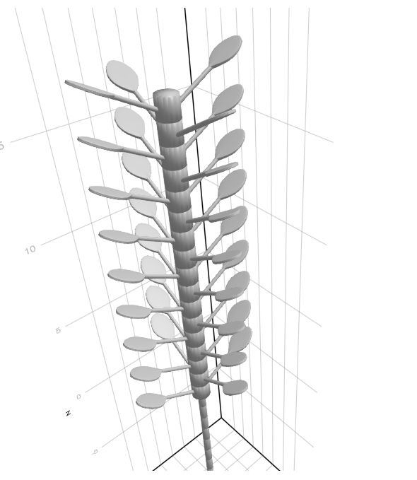

```@meta
CurrentModule = PlantSimEngine
```

```@setup home
using PlantSimEngine, PlantMeteo, Dates, DataFrames, CairoMakie
using PlantSimEngine.Examples

# The bundled file contains daily radiation totals; Beer expects mean fluxes.
meteo_day = read_weather(
    joinpath(pkgdir(PlantSimEngine), "examples/meteo_day.csv"),
    :Ri_SW_f => (x -> x .* 1e6 ./ 86_400) => :Ri_SW_f,
    :Ri_PAR_f => (x -> x .* 1e6 ./ 86_400) => :Ri_PAR_f,
    :Ri_NIR_f => (x -> x .* 1e6 ./ 86_400) => :Ri_NIR_f;
    duration=Dates.Day,
)
canopy = CompositeModel(
    ToyDegreeDaysCumulModel(), ToyLAIModel(), Beer(0.6);
    environment=meteo_day,
)
canopy_sim = run!(canopy; steps=length(meteo_day), outputs=:all)
canopy_out = collect_outputs(canopy_sim; sink=DataFrame)
lai = canopy_out[canopy_out.variable .== :LAI, :value]
appfd = canopy_out[canopy_out.variable .== :aPPFD, :value]
tt_cu = canopy_out[canopy_out.variable .== :TT_cu, :value]
seconds_per_day = Dates.value.(Second.(meteo_day[:duration]))
absorbed_par_day = appfd .* seconds_per_day ./ 1e6

canopy_figure = Figure(size=(720, 490), fontsize=16)
ax_lai = Axis(canopy_figure[1, 1], ylabel="LAI (m² m⁻²)")
lines!(ax_lai, tt_cu, lai, color="#156f64", linewidth=2.5)
ax_par = Axis(canopy_figure[2, 1],
    xlabel="Growing degree days since sowing (°C d)",
    ylabel="Absorbed PAR\n(mol m⁻² d⁻¹)",
)
lines!(ax_par, tt_cu, absorbed_par_day, color="#b46237", linewidth=2)
save("home-canopy.svg", canopy_figure)

include(joinpath(pkgdir(PlantSimEngine), "skills", "plantsimengine", "assets", "alternative-model.jl"))
using .AlternativeModelExample
linear = LinearCarbonGain(0.2)
saturating = SaturatingCarbonGain(10.0, 5.0)
@assert Authoring.compare_models(linear, saturating).override_compatible

function carbon_response(process_model, light)
    model = CompositeModel(process_model;
        id=:plant, scale=:Plant, kind=:plant,
        status=(absorbed_par=light,),
    )
    final_state(run!(model)).carbon_gain
end
light_values = collect(0.0:1.0:50.0)
linear_gain = [carbon_response(linear, light) for light in light_values]
saturating_gain = [carbon_response(saturating, light) for light in light_values]
@assert all(isfinite, linear_gain) && all(isfinite, saturating_gain)
@assert first(linear_gain) == first(saturating_gain) == 0.0
comparison_figure = Figure(size=(760, 400), fontsize=16)
ax_response = Axis(comparison_figure[1, 1],
    xlabel="Absorbed PAR (mol photons plant⁻¹ d⁻¹)",
    ylabel="Carbon gain (g C plant⁻¹ d⁻¹)",
)
lines!(ax_response, light_values, linear_gain;
    label="Linear response", color="#156f64", linewidth=3)
lines!(ax_response, light_values, saturating_gain;
    label="Saturating response", color="#b46237", linewidth=3)
axislegend(ax_response; position=:lt, framevisible=false)
save("home-model-comparison.svg", comparison_figure)
```

# From process models to plant simulations

PlantSimEngine connects and runs models of plant processes such as light
interception, photosynthesis and growth. You choose the equations, using
[existing model packages](#Scientific-models-and-further-reading) or writing
your own. PlantSimEngine manages their
connections, execution order, time steps and simulation outputs in Julia.

You can represent a whole crop canopy, individual plants, or their organs.
**You choose the level of detail; 3D geometry is optional.** Small, testable
models and clear reports on their connections also support
[AI-assisted model development](agent_skill.md).

For scientific equations, explore packages such as
[PlantBiophysics.jl](https://github.com/VEZY/PlantBiophysics.jl), for plant
biophysical processes, and [XPalm](https://github.com/PalmStudio/XPalm.jl), for
oil-palm growth. Their documentation describes the models, assumptions and
supported package versions.

## See what you can build

These examples show two ways to represent a plant system. The canopy curves
are calculated when this documentation is built, using teaching models and a
full year of weather. The 3D image illustrates an explicit organ structure.

```@raw html
<div class="pse-home-examples">
  <figure>
    
    <figcaption><strong>A crop canopy over a season.</strong> Connect thermal time, leaf area index (LAI) and light interception without describing individual leaves. <a href="journeys/users/one_object.html">Couple models for a canopy →</a></figcaption>
  </figure>
  <figure>
    
    <figcaption><strong>A plant described by its organs.</strong> Apply models to leaves and combine their outputs at plant level. This is an illustrative 3D structure, not the output of the canopy example. <a href="journeys/users/one_plant.html">Connect organ and plant models →</a></figcaption>
  </figure>
</div>
```

For plant–environment interactions, the
[MAESPA-style example](journeys/users/maespa_synthesis.md) combines two species,
leaf exchanges, soil water and daily growth. It is an advanced teaching
example of coupling these processes, rather than a validated reproduction of
MAESPA.

## Compare a different hypothesis

What happens if carbon gain stops increasing in proportion to absorbed light?
Here, the same small simulation is run with a linear response and then a
saturating response. Only the carbon-gain model changes. Both models declare
the same inputs, outputs and units, so PlantSimEngine can check whether
one can replace the other.


The coefficients are illustrative. These curves demonstrate how to compare
model formulations; they are not calibrated predictions for a crop or species.
The models come from the [examples supplied for model authors and AI agents](agent_skill.md).
Follow the [model replacement guide](step_by_step/model_switching.md) to try
alternatives and check whether their inputs require different connections.

## Build and change simulations with confidence

- **Keep equations separate from the scenario.** Write a process model once,
  then choose which plants or organs use it, its parameters and its connections.
  [Reuse models across several plants](journeys/users/several_plants.md).
- **Combine different time steps.** Connect hourly exchanges and daily growth,
  stating when values should be accumulated, averaged or held between updates.
  [Connect hourly and daily models](journeys/users/cadences.md).
- **Follow changes in plant structure.** Add or remove organs during a
  simulation and let PlantSimEngine update the affected model connections.
  [Model a changing structure](journeys/users/structure_changes.md).
- **Inspect what is connected.** Find the source of an input, inspect the
  execution order and diagnose missing or ambiguous connections.
  [Explore a model graph](guides/graph_visualizer_editor.md).
- **Control interactions that need iteration.** For example, a canopy solver
  can repeatedly call leaf models until an energy balance converges, then
  record the accepted result. [Control iterative calculations](guides/multiscale/manual_calls.md).
- **Run repeated simulations efficiently.** PlantSimEngine prepares model
  connections before the time loop and reuses them during execution. This
  avoids resolving those connections again at every time step, including when
  models run on many organs.
  [Read about the design and performance evidence](introduction/why_plantsimengine.md).

## Work with an AI coding agent

An **AI coding agent** is software that can read and edit code and run tests
with your development tools. PlantSimEngine is designed to support this way
of working: models expose their inputs and outputs, and can declare units and
other scientific conventions. Tools report model compatibility, missing inputs
and simulation connections. A versioned
**agent skill** provides instructions and tested examples for the installed
package. These give an agent concrete information to implement, inspect and
check a proposed model or coupling. You guide the scientific assumptions and
validate the equations, parameters and results.

[Set up an agent for PlantSimEngine](agent_skill.md), or use the same
[model descriptions and checks](API/model_catalog.md) directly from Julia.

## Choose your starting point

| Your next step | What you will do |
|:--|:--|
| [Couple existing models](journeys/users/one_object.md) | Start with three teaching models, supply weather, run a simulation and read its results. |
| [Write a process model](journeys/modelers/basic_model.md) | Implement an equation, declare its inputs and outputs, test it and use it in a simulation. |
| [Understand how the pieces fit together](journeys/users/mental_model.md) | Learn the few ideas shared by both workflows, before reading detailed configuration. |

The examples introduce Julia as it is needed. If you are new to the language,
start with [installation](prerequisites/installing_plantsimengine.md) and
[Julia basics](prerequisites/julia_basics.md).

## A small simulation in Julia

The canopy example above connects three existing models: temperature drives
thermal time, thermal time drives LAI, and LAI and radiation determine absorbed
photosynthetically active radiation (PAR). The phenology and LAI models are
teaching examples, not a calibrated crop model.

First follow the [installation instructions](prerequisites/installing_plantsimengine.md)
to get the package version used by this manual and the tutorial dependencies.

Read the weather supplied with PlantSimEngine. This file stores daily radiation
totals in MJ m⁻² d⁻¹; the three conversions below give the mean fluxes in
W m⁻² required by the light-interception model.

```@example home
using PlantSimEngine, PlantMeteo, Dates, DataFrames
using PlantSimEngine.Examples

meteo_day = read_weather(
    joinpath(pkgdir(PlantSimEngine), "examples/meteo_day.csv"),
    :Ri_SW_f => (x -> x .* 1e6 ./ 86_400) => :Ri_SW_f,
    :Ri_PAR_f => (x -> x .* 1e6 ./ 86_400) => :Ri_PAR_f,
    :Ri_NIR_f => (x -> x .* 1e6 ./ 86_400) => :Ri_NIR_f;
    duration=Dates.Day,
)
nothing # hide
```

Choose the models and run the full weather year:

```@example home
model = CompositeModel(
    ToyDegreeDaysCumulModel(),
    ToyLAIModel(),
    Beer(0.6);
    environment=meteo_day,
)

simulation = run!(model; steps=length(meteo_day), outputs=:all)
results = collect_outputs(simulation; sink=DataFrame)
nothing # hide
```

The thermal-time model supplies the LAI model, which supplies the light
model. PlantSimEngine connects them using their matching input and output
names. The result table contains their outputs over time. The
[step-by-step tutorial](journeys/users/one_object.md) explains these connections
and shows how to continue a simulation; the
[plotting guide](guides/data/outputs_plotting.md) explains how to display results.

## Scientific models and further reading

PlantSimEngine provides the simulation tools. Model packages provide equations,
parameters and their scientific validation. Examples of packages using
PlantSimEngine include:

- [PlantBiophysics.jl](https://github.com/VEZY/PlantBiophysics.jl), for plant
  biophysical processes such as photosynthesis, stomatal conductance and energy balance.
- [XPalm](https://github.com/PalmStudio/XPalm.jl), for oil-palm growth and development.

Their documentation describes the models available, their assumptions and
supported package versions. To choose an approach, read
[Why PlantSimEngine?](introduction/why_plantsimengine.md). For a published
application and its validation, see the
[PlantBiophysics paper](https://doi.org/10.1093/insilicoplants/diaf021).

PlantSimEngine is open source under the MIT license. For questions or feedback,
[open an issue](https://github.com/VirtualPlantLab/PlantSimEngine.jl/issues)
or join the [Virtual Plant Lab discussion](https://fspm.discourse.group/c/software/virtual-plant-lab).

[](https://github.com/VirtualPlantLab/PlantSimEngine.jl/actions/workflows/CI.yml?query=branch%3Amain)
[](https://codecov.io/gh/VirtualPlantLab/PlantSimEngine.jl)
[](https://zenodo.org/badge/latestdoi/571659510)
[](https://joss.theoj.org/papers/137e3e6c2ddc349bec39e06bb04e4e09)
