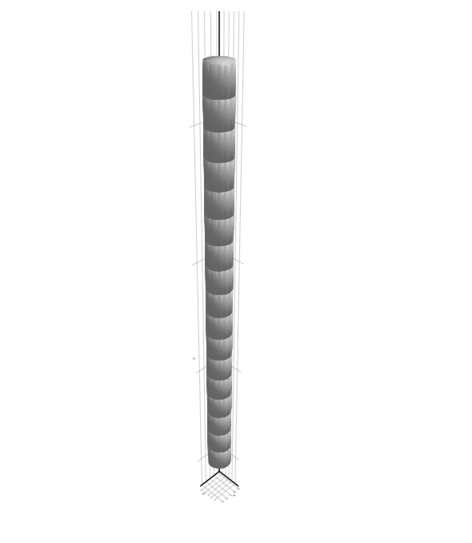
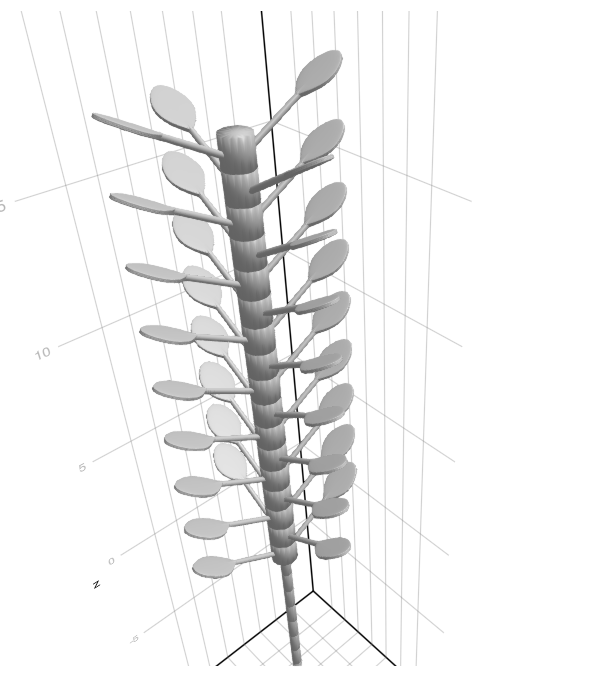

# Visualizing a plant using PlantGeom

We've created our toy plant, part of the fun is to actually visualize it !

Let's see how to do so with the [PlantGeom](https://github.com/VEZY/PlantGeom.jl) companion package.

We'll be reusing the mtg from part 3 of the plant tutorial: [Fixing bugs in the plant simulation](@ref), so you need to run that simulation first, or to include the script file into your current code (which is what we'll do here):

```julia
using PlantSimEngine
using MultiScaleTreeGraph
using PlantSimEngine.Examples
using Pkg
Pkg.add("CSV")
using CSV
include("ToyPlantSimulation3.jl")
```

You'll need to add PlantGeom and a compatible visualization package to your environment. We'll use Plots:

```julia
using Plots
using PlantGeom
```

That's enough to get a nicer display of the MTG than the console-based printing. You'll only need to type the following line:

```julia
RecipesBase.plot(mtg)
```

This provides the following visualization:


And that's it !

We can see the root expansion in one direction, and the internodes with their leaves in the other.

Of course, that's good and all, but going beyond that would be nice. 

PlantGeom is able to render geometry from what it finds in the MTG. If a node in the tree graph has a `:geometry` attribute with a mesh and a transformation, it can make use of that to build a plant. That mesh can be unique per node, or based on a reference mesh that is copied and transformed for every node.

!!! note 
    This page simply aims to illustrate PlantGeom's features and doesn't aim for a particularly realistic or aesthetic look. A little randomness could go a long way to make the plant look a little more life-like, but would also be very ad-hoc and make the code less clear.

Our MTG doesn't have any such attribute, so we'll need to iterate on our nodes, provide them with a mesh and calculate appropriate transformations. We'll use one reference mesh for each plant-related scale, Internode, Root and Leaf. 

We'll make use of some of the Meshes primitives and transformations, as well as some helper functions from the packages TransformsBase and Rotations. For leaves, we'll read a .ply file using the PlyIO package, which contains a very unrealistic leaf + petiole mesh.

We'll also make our plant opposite decussate: leaves come in pairs, and pairs are rotated by 90 degrees along the stem.

The function that'll provide the geometry to the node is:
```julia 
PlantGeom.Geometry(; ref_mesh<:RefMesh, transformation=Identity(), dUp=1.0, dDwn=1.0, mesh::Union{SimpleMesh,Nothing}=nothing)
```

We only care about the first two parameters in our case, and we can use a simple cylinder for each node of our single Internode stem and single Root.

```julia
using PlantGeom.Meshes

# Internodes and roots will use a cylinder as a mesh

cylinder() = Meshes.CylinderSurface(1.0) |> Meshes.discretize |> Meshes.simplexify

refmesh_internode = PlantGeom.RefMesh("Internode", cylinder())
refmesh_root = PlantGeom.RefMesh("Root", cylinder())
```

A simple function to read the vertices and faces from the .ply file for our leaves:

```julia
Pkg.add("PlyIO")
using PlyIO
function read_ply(fname)
    ply = PlyIO.load_ply(fname)
    x = ply["vertex"]["x"]
    y = ply["vertex"]["y"]
    z = ply["vertex"]["z"]  
    points = Meshes.Point.(x, y, z)
    connec = [Meshes.connect(Tuple(c .+ 1)) for c in ply["face"]["vertex_indices"]]
    Meshes.SimpleMesh(points, connec)
end

leaf_ply = read_ply("examples/leaf_with_petiole.ply")
refmesh_leaf = PlantGeom.RefMesh("Leaf", leaf_ply)
```

```julia
Pkg.add("TransformsBase")
Pkg.add("Rotations")
import TransformsBase: →
import Rotations: RotY, RotZ, RotX
```

!!! note 
    We'll use X, Y, Z as standard cartersian coordinate axes, with Z pointing upwards. 

We can then write the function that adds the geometry to our MTG.

It traverses the MTG, starting from the base, and adds a transformation for each encountered node.

The following just operates on internodes, for clarity:

```julia
# Add the geometry to the MTG, with transformations
function add_geometry!(mtg, refmesh_internode) 
    
    # incremental offset
    internode_height = 0.0

    # relative scale of the base mesh
    internode_width = 0.5

    # length of the base mesh
    internode_length = 1.0

    traverse!(mtg) do node
        if symbol(node) == "Internode"
            # Set to scale, then translate by the total height
            mesh_transformation = Meshes.Scale(internode_width, internode_width, internode_length) → Meshes.Translate(0.0, 0.0, internode_height)
            node.geometry = PlantGeom.Geometry(ref_mesh=refmesh_internode, transformation=mesh_transformation)
            
            internode_height += node_length
        end
    end
end
```

We simply need to choose a given width for our stem, and increment the height to place our next internode at as we traverse it. 

Note that the default cylinder provided by Meshes.jl points upwards, which is why there is no need for rotation. Roots function likewise, but are simply translated down, and need to start below the origin.

We can visualize this simple stem, using GLMakie as a rendering backend:

```julia
add_geometry!(mtg, refmesh_internode)

# Visualize the mesh
using GLMakie
viz(mtg)
```    



On the other hand, the leaf mesh will need to be rotated, but it is aligned along the X axis, so there is no need for an initial reorientation (which would have been required if it was pointing upwards like the cylinders). The petiole starts at the origin, so on top of translating them to leaf height we also need to translate them away from the Z axis by the internode radius. The mesh also needs to be scaled, as it is only 0.1 unit lengths long compared to our 0.5-width internode.

Let's also rotate our leaves so that they point upwards slightly.

If you make use of other meshes, bear in mind the initial starting translation, orientation and scale. You may need to test and calibrate scales and transformations before you get it right.

The full code that generates geometry for all the organs of our toy plant is the following:
```julia
# Add the geometry to the MTG, with transformations
function add_geometry!(mtg, refmesh_internode, refmesh_root, refmesh_leaf) 
    
    # incremental offset
    internode_height = 0.0
    root_depth = 0.0

    # relative scale of the base mesh (base cylinder is of height 1 and radius 1)
    internode_width = 0.5
    root_width = 0.2

    # length of the base mesh
    internode_length = 1.0
    root_length = 1.0

    # ad hoc value to adjust the leaf mesh to the scene scale
    leaf_mesh_scale = 25

    leaf_scale_width = 0.4*leaf_mesh_scale
    leaf_scale_height = 0.4*leaf_mesh_scale
    
    # Helpers to make the leaves opposite decussate
    leaf_rotation = MathConstants.pi / 2.0
    i = 0

    traverse!(mtg) do node
        if symbol(node) == "Internode"
            # Set to scale, then translate by the total height
            mesh_transformation = Meshes.Scale(internode_width, internode_width, internode_length) → Meshes.Translate(0.0, 0.0, internode_height)
            node.geometry = PlantGeom.Geometry(ref_mesh=refmesh_internode, transformation=mesh_transformation)
            
            internode_height += internode_length

            # Leaves are placed relatively to the parent internode, halfway along it
            for chnode in children(node)               
                if symbol(chnode) == "Leaf" 
                    mesh_transformation = Meshes.Scale(leaf_scale_width, leaf_scale_width, leaf_scale_height) → Meshes.Rotate(RotX(-MathConstants.pi / 6.0)) → Meshes.Translate(0.0, -internode_width, internode_height - internode_length / 2.0) → Meshes.Rotate(RotZ(leaf_rotation))
                    chnode.geometry = PlantGeom.Geometry(ref_mesh=refmesh_leaf, transformation=mesh_transformation)
                    # Set the second leaf in a pair opposite to the first one => add a 180° rotation
                    leaf_rotation += MathConstants.pi
                end                
            end

            # Opposite decussate => 90° rotation between pairs
            i += 1
            if i % 2 == 0
                leaf_rotation = MathConstants.pi / 2.0
            else
                leaf_rotation = MathConstants.pi
            end

        elseif symbol(node) == "Root"
            mesh_transformation = Meshes.Scale(root_width, root_width, root_length) → Meshes.Translate(0.0, 0.0, root_depth) → Meshes.Rotate(RotZ(MathConstants.pi))
            node.geometry = PlantGeom.Geometry(ref_mesh=refmesh_root, transformation=mesh_transformation)
            root_depth -= root_length
        end
    end
end
```

And now, let's visualize our fully-grown, fully-featured plant:

```julia
# Visualize the mesh
using GLMakie
viz(mtg)    
```

Which gives us the following image scene:



Feel free to try and make this plant prettier, more colourful, or more physically realistic, using more realistic models on the PlantSimEngine side, or better geometry on the Plantgeom end.