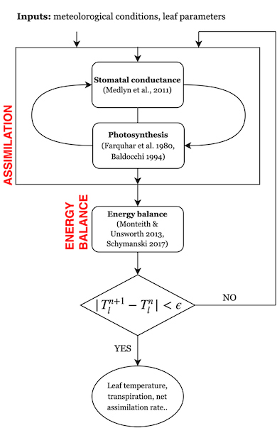
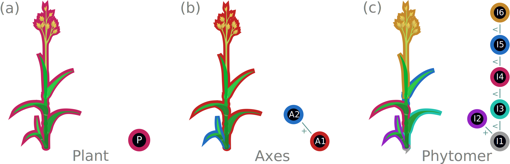

# Key Concepts

You'll find a brief description of some of the main concepts and terminology related to and used in PlantSimEngine.

```@contents
Pages = ["key_concepts.md"]
Depth = 4
```

## Crop models

## FSPM

## PlantSimEngine terminology

This page provides a general description of the concepts and terminology used in PlantSimEngine. For a more implementation-guided description of the design and some of the terms presented here, see the [Detailed walkthrough of a simple simulation](@ref detailed-walkthrough-of-a-simple-simulation)

!!! Note
    Some terminology has different meanings in different contexts. This is particularly true of the terms organ, scale and symbol, which have a different meaning for [Multi-scale Tree Graphs](@ref) than the rest of PlantSimEngine (see [Scale/symbol terminology ambiguity](@ref) further down). Make sure to double-check those subsections, and relevant examples if you encounter issues relating to these terms.

### Processes

A process in this package defines a biological or physical phenomena. Think of any process happening in a system, such as light interception, photosynthesis, water, carbon and energy fluxes, growth, yield or even electricity produced by solar panels.

See [Implementing a new process](@ref) for a brief explanation on how to declare a new process.

### Models

A model is a particular implementation for the simulation of a process.

There may be different models that can be used for the same process; for instance, there are multiple hypotheses and ways of modeling photosynthesis, with different granularity and accuracy. A simple photosynthesis model might apply a simple formula and apply it to the total leaf surface, a more complex one might calculate interception and light extinction.

!!! note
    The companion package PlantBiophysics.jl provides the [`Beer`](https://vezy.github.io/PlantBiophysics.jl/stable/functions/#PlantBiophysics.Beer) structure for the implementation of the Beer-Lambert law of light extinction. The process of `light_interception` and the `Beer` model are provided as an example script in this package too at [`examples/Beer.jl`](https://github.com/VirtualPlantLab/PlantSimEngine.jl/blob/master/examples/Beer.jl).

Models can also be used for ad hoc computations that aren't directly tied to a specific literature-defined physiological process. In PlantSimEngine, everything is a model. There are many instances where a custom model might be practical to aggregate some computations or handle other information. To illustrate, XPalm, the Oil Palm model, has a few models that handle the state of different organs, and a model to handle leaf pruning, which you can find [here](https://github.com/PalmStudio/XPalm.jl/blob/main/src/plant/phytomer/leaves/leaf_pruning.jl).

To prepare a simulation, you declare a ModelList with whatever models you wish to make use of and initialize necessary parameters: see the [step by step](@ref detailed-walkthrough-of-a-simple-simulation) section to learn how to use them in practice.

For multi-scale simulations, models need to be tied to a particular scale when used. See the [Multiscale modeling](@ref) section below, or the [Multi-scale considerations](@ref) page for a more detailed description of multi-scale peculiarities.

### Variables, inputs, outputs, and model coupling

A model used in a simulation requires some input data and parameters, and will compute some other data which may be used by other models. Depending on what models are combined in a simulation, some variables may be inputs of some models, outputs of other models, only be part of intermediary computations, or be a user input to the whole simulation.

Here's a conceptual model coupling; each "node" is equivalent to a distinct PlantSimEngine model, "compute()" is equivalent to the model's "run!" function:


(Source: [Autodesk](https://help.autodesk.com/view/MAYAUL/2016/ENU/?guid=__files_GUID_A9070270_9B5D_4511_8012_BC948149884D_htm"))

### Dependency graphs

Coupling models together in this fashion creates what is known as a [Directed Acyclic Graph](https://en.wikipedia.org/wiki/Directed_acyclic_graph) or DAG, a type of [dependency graph](https://en.wikipedia.org/wiki/Dependency_graph). The order in which models are run is determined by the ordering of these models in that graph.


A simple Directed Acyclic Graph, note the required absence of cycles. Source: [Astronomer](https://www.astronomer.io/docs/learn/dags/) (Note: "Not Acyclic" is simply "Cyclic").

PlantSimEngine creates this Directed Acyclic Graph automatically by plugging the right variables in the right models. Users therefore only need to declare models, they do not need to write the code to connect them as PlantSimEngine does that work for them, as long as the model coupling has no cyclic dependency.

### ["Hard" and "Soft" dependencies](@id hard_dependency_def)

Linking models by setting output variables from one model as input of another model handles many typical couplings (with more situations occurring with multi-scale models and variables), but what if two models are interdependent? What if they need to iterate on some computation and pass variables back and forth?

You can find a typical example in a companion package: [PlantBioPhysics.jl](https://github.com/VEZY/PlantBiophysics.jl). An energy balance model, the [Monteith model](https://github.com/VEZY/PlantBiophysics.jl/blob/master/src/processes/energy/Monteith.jl), needs to [iteratively run a photosynthesis model](https://github.com/VEZY/PlantBiophysics.jl/blob/c1a75f294109d52dc619f764ce51c6ca1ea897e8/src/processes/energy/Monteith.jl#L154) in its [`run!`](@ref) function. 

See the illustration below of the way these models are interdependent:



Example of a coupling with a cycle. Source: PlantBioPhysics.jl

Model couplings that cause simulation to flow both ways break the 'acyclic' assumption of the dependency graph.

PlantSimEngine handles this internally by not having those "heavily-coupled" models -called **hard dependencies** from now on- be part of the main dependency graph. Instead, modelers should call these models manually from within a model. This way, they are made to be children nodes of the parent/ancestor model, which handles them internally, so they aren't tied to other nodes of the dependency graph. The resulting higher-level graph therefore only links models without any two-way interdependencies, and remains a directed graph, enabling a cohesive simulation order. The simpler couplings in that top-level graph are called "soft dependencies".


The previous coupling, handled by PlantSimEngine

How PlantSimEngine links these models under the hood. The red models ("hard dependencies") are not exposed in the final dependency graph, which only contains the blue "soft dependencies", and has no cycles.

This approach does have implications when developing interdependent models: hard dependencies need to be made explicit, and the ancestor needs to call the hard dependency model's [`run!`](@ref) function explicitely in its own [`run!`](@ref) function. Hard dependency models therefore must have only one parent model.

This reliance on another process makes these models slightly more complex to develop and validate, but keep the versatility of the implementation, as any model implementing the hard-dependency process can be passed by the user.

Note that hard dependencies can also have their own hard dependencies, and some complex couplings can happen.

### Weather data

To run a simulation, we usually need the climatic/meteorological conditions measured close to the object or component.

Users are strongly encouraged to use [`PlantMeteo.jl`](https://github.com/PalmStudio/PlantMeteo.jl), the companion package that helps manage such data, with default pre-computations and structures for efficient computations. We will make constant use of it throughout the documentation, and recommend working with it.

The most basic data structure from this package is a type called [`Atmosphere`](https://palmstudio.github.io/PlantMeteo.jl/stable/#PlantMeteo.Atmosphere), which defines steady-state atmospheric conditions, *i.e.* the conditions are considered at equilibrium. Another structure is available to define different consecutive time-steps: [`TimeStepTable`](https://palmstudio.github.io/PlantMeteo.jl/stable/#PlantMeteo.TimeStepTable).

The mandatory variables to provide for an [`Atmosphere`](https://palmstudio.github.io/PlantMeteo.jl/stable/#PlantMeteo.Atmosphere) are: `T` (air temperature in °C), `Rh` (relative humidity, 0-1) and `Wind` (the wind speed, m s⁻¹).

In the example below, we also pass in the -optional- incoming photosynthetically active radiation flux (`Ri_PAR_f`, W m⁻²). We can declare such conditions like so:

```@example usepkg
using PlantMeteo
meteo = Atmosphere(T = 20.0, Wind = 1.0, Rh = 0.65, Ri_PAR_f = 500.0)
```

More details are available from the [package documentation](https://vezy.github.io/PlantMeteo.jl/stable). If you do not wish to make use of this package, you can alternately provide your own data, as long as it respects the [Tables.jl interface](https://tables.juliadata.org/stable/#Implementing-the-Interface-(i.e.-becoming-a-Tables.jl-source)) (*e.g.* use a `DataFrame`).

If you wish to make use of more fine-grained weather data, it will likely require more advanced model creation and MTG manipulation, and more involved work on the modeling side.

### Organ/Scale

Plants have different organs with distinct physiological properties and processes. When doing more fine-grained simulations of plant growth, many models will be tied to a particular organ of a plant. Models handling flowering state or root water absorption are such examples. Others, such as carbon allocation and demand, might be reused in slightly different ways for multiple organs of the plant.

PlantSimEngine documentation tends to use the terms "organ" and "scale" mostly interchangeably. "Scale" is a bit more general and accurate, since some models might not operate at a specific organ level, but (for example) at the scene level, so a "Scene" scale might be present in the MTG, and in the user-provided data.

When working with multi-scale data, the scale will often need to be specified to map variables, or to indicate at what scale level models work out. You will see some code resembling this :

```julia
"Root" => (RootGrowthModel(), OrganAgeModel()),
"Leaf" => (LightInterceptionModel(), OrganAgeModel()),
"Plant" => (TotalBiomassModel(),),
```

This example excerpt links from specific models to a specific scale. Note that one model is reused at two different scales, and note that "Plant" isn't an actual organ, hence the preferred usage of the term "scale".

### Multiscale modeling

Multi-scale modeling is the process of simulating a system at multiple levels of detail simultaneously. Some models might run at the organ scale while others run at the plot scale. Each model can access variables at its scale and other scales if needed, allowing for a more comprehensive system representation. It can also help identify emergent properties that are not apparent at a single level of detail.

For example, a model of photosynthesis at the leaf scale can be combined with a model of carbon allocation at the plant scale to simulate the growth and development of the plant. Another example is a combination of models to simulate the energy balance of a forest. To simulate it, you need a model for each organ type of the plant, another for the soil, and finally, one at the plot scale, integrating all others.

When running multi-scale simulations which contain models operating at different organ levels for the plant, extra information needs to be provided by the user to run models. Since some models are reused at different organ levels, it is necessary to indicate which organ level a model operates at.

This is why multi-scale simulations make use of a 'mapping': the ModelList in the single-scale examples does not have a way to tie models to plant organs, and the more versatile models could be used in various places. The user must also indicate how models operate with other scales, *e.g.* if an input variable comes from another scale, it is required to indicate which scale it is mapped from.

You can read more about some practical differences as a user between single- and multi-scale simulations here: [Multi-scale considerations](@ref).

!!! note
    When you encounter the terms "Single-scale simulations", or "ModelList simulations", they will refer to simulations that are "not multi-scale". A multi-scale simulation makes use of a mapping between different organ/scale levels. A single-scale simulation has no such mapping, and uses the simpler ModelList interface.
    You can implement a mapping that only makes use of a single scale level, of course, making it a "single-scale multi-scale simulation", but **unless otherwise specified, single-scale, and the whole section dedicated to single-scale simulations, refer to simulations with ModelList objects, and no mapping**.

### Multi-scale Tree Graphs


A Grassy plant and its equivalent MTG

Multi-scale Tree Graphs (MTG) are a data structure used to represent plants. A more detailed introduction to the format and its attributes can be found [in the MultiScaleTreeGraph.jl package documentation](https://vezy.github.io/MultiScaleTreeGraph.jl/stable/the_mtg/mtg_concept/).

Multi-scale simulations can operate on MTG objects; new nodes are added corresponding to new organs created during the plant's growth.

You can see a basic display of an MTG by simply typing its name in the REPL:


!!! note
    Another companion package, [PlantGeom.jl](https://github.com/VEZY/PlantGeom.jl), can also create MTG objects from .opf files (corresponding to the [Open Plant Format](https://amap-dev.cirad.fr/projects/xplo/wiki/The_opf_format_(*opf)), an alternate means of describing plants computationally).

#### Scale/symbol terminology ambiguity

Multi-scale tree graphs have different terminology (see [Organ/Scale](@ref)):

- the MTG node **symbol** represents "something" like a "Plant", "Root", "Scene" or "Leaf". It corresponds to a PlantSimEngine *scale* and has nothing to do with the Julia programming language's definition of symbol (*e.g.* `:var`)
- the MTG node **scale**, is an integer passed to the Node constructor, and describes the level of description of the tree graph object. They don't always have a one-to-one correspondence to the symbol (or PlantSimEngine's scale), but are similar.



You can find a brief description of the MTG concepts [here](https://vezy.github.io/MultiScaleTreeGraph.jl/stable/the_mtg/mtg_concept/#Node-MTG-and-attributes).

Other words are unfortunately reused in various contexts with different meanings: tree/leaf/root have a different meaning when talking about computer science data structure (*e.g.*, graphs, dependency graphs and trees).

!!! note
    In the majority of cases, you can assume the tree-related terminology refers to the biological terms, and that "organ" refer to plant organs, and "single-scale", "multi-scale" and "scale" to PlantSimEngine's concept of scales described in [Organ/Scale](@ref). MTG objects are mostly manipulated on a per-node basis (the graph node, not the botanical node), unless a model makes use of functions relating to MTG traversal, in which case you may expect computer science terminology.

#### TLDR

In summary:

- In PlantSimEngine a scale is a level of description defined by a name (`String`). In MTG, a scale is an integer describing the level of description of the node, and a symbol is a name for that node. So symbol in the MTG == scale in PlantSimEngine;
- The word "node" is always used to refer to the Multiscale Tree Graph node, not the botanical node.

### State machines

A state machine is a computational concept used to model mechanisms and devices, which may be of interest for your simulations.


A simple state machine. See the [wikipedia page](https://en.wikipedia.org/wiki/Finite-state_machine) for more examples.

State machines can be useful to model organ state: some organs in [XPalm.jl](https://github.com/PalmStudio/XPalm.jl), a package modelling the oil palm using PlantSimEngine, have a `state` variable behaving like a state machine, indicating whether an organ is mature, pruned, flowering, etc.

You can find an example model (amongst other such models) affecting the `state` variable of some organs depending on their age and thermal time in the XPalm oil palm FSPM [here](https://github.com/PalmStudio/XPalm.jl/blob/main/src/plant/phytomer/phytomer/state.jl).
