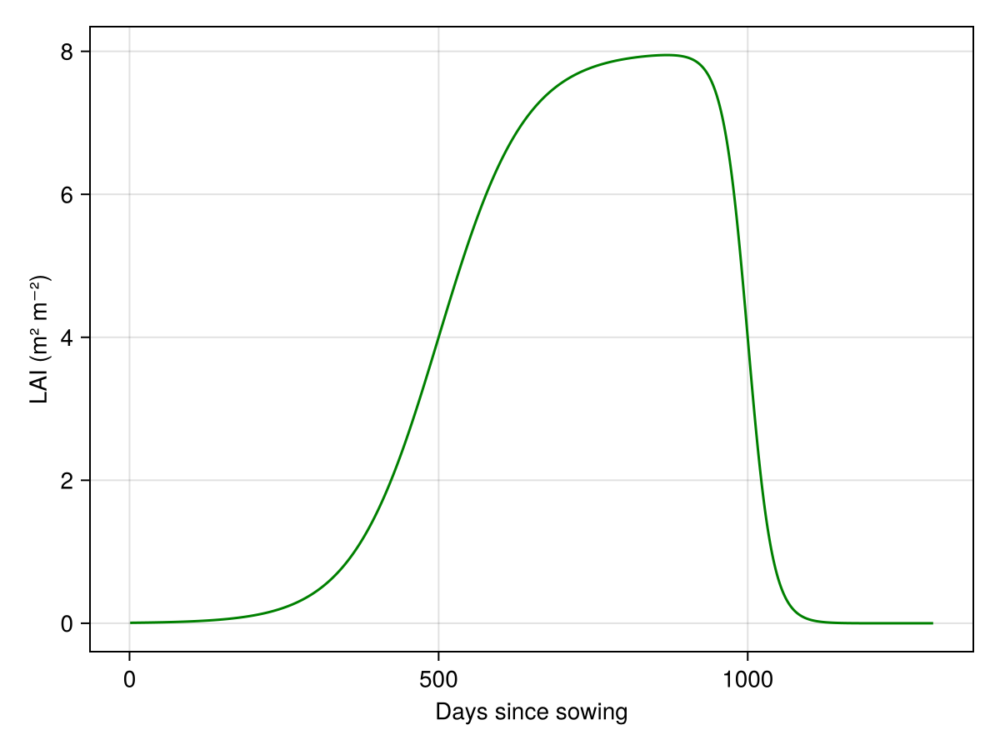
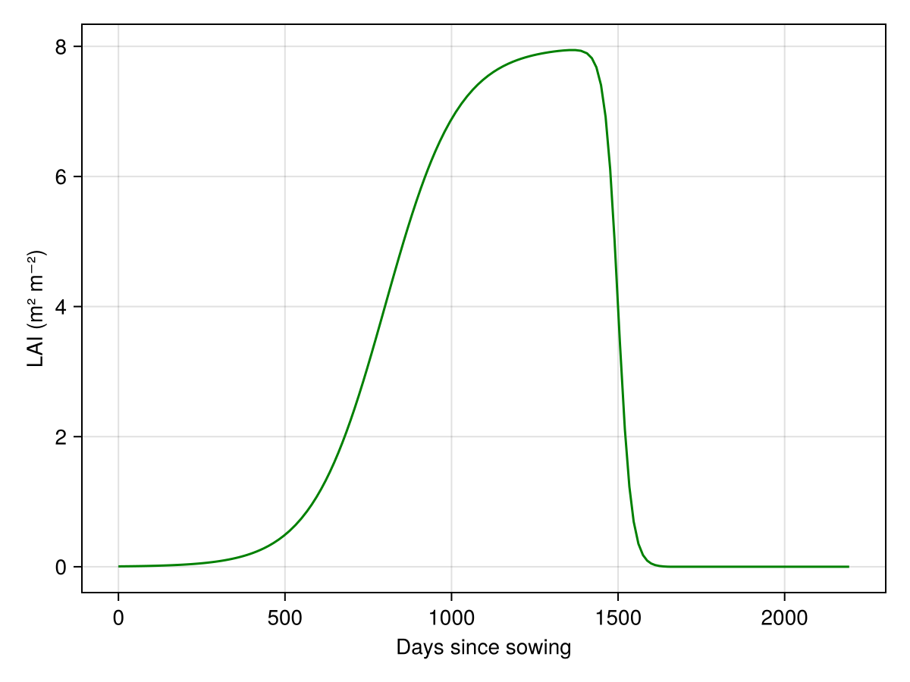

# I want to use PlantSimEngine for my model {#I-want-to-use-PlantSimEngine-for-my-model}

If you already have a model, you can easily use `PlantSimEngine` to couple it with other models with minor adjustments.

## Toy LAI Model {#Toy-LAI-Model}

### Model description {#Model-description}

Let&#39;s take an example with a simple LAI model that we define below:

```julia
"""
Simulate leaf area index (LAI, m² m⁻²) for a crop based on the amount of degree-days since sowing with a simple double-logistic function.

# Arguments

- `TT_cu`: degree-days since sowing
- `max_lai=8`: Maximum value for LAI
- `dd_incslope=500`: degree-days at which we get the maximal increase in LAI
- `inc_slope=5`: slope of the increasing part of the LAI curve
- `dd_decslope=1000`: degree-days at which we get the maximal decrease in LAI
- `dec_slope=2`: slope of the decreasing part of the LAI curve
"""
function lai_toymodel(TT_cu; max_lai=8.0, dd_incslope=500, inc_slope=70, dd_decslope=1000, dec_slope=20)
    LAI = max_lai * (1 / (1 + exp((dd_incslope - TT_cu) / inc_slope)) - 1 / (1 + exp((dd_decslope - TT_cu) / dec_slope)))
    if LAI < 0
        LAI = 0
    end
    return LAI
end
```


This model takes the number of days since sowing as input and returns the simulated LAI. We can plot the simulated LAI for a year:

```julia
using CairoMakie

lines(1:1300, lai_toymodel.(1:1300), color=:green, axis=(ylabel="LAI (m² m⁻²)", xlabel="Days since sowing"))
```



### Changes for PlantSimEngine {#Changes-for-PlantSimEngine}

The model can be implemented using `PlantSimEngine` as follows:

#### Define a process {#Define-a-process}

If the process of LAI dynamic is not implement yet, we can define it like so:

```julia
@process LAI_Dynamic
```


#### Define the model {#Define-the-model}

We have to define a structure for our model that will contain the parameters of the model:

```julia
struct ToyLAIModel <: AbstractLai_DynamicModel
    max_lai::Float64
    dd_incslope::Int
    inc_slope::Float64
    dd_decslope::Int
    dec_slope::Float64
end
```


We can also define default values for the parameters by defining a method with keyword arguments:

```julia
ToyLAIModel(; max_lai=8.0, dd_incslope=500, inc_slope=70, dd_decslope=1000, dec_slope=20) = ToyLAIModel(max_lai, dd_incslope, inc_slope, dd_decslope, dec_slope)
```


This way users can create a model with default parameters just by calling `ToyLAIModel()`, or they can specify only the parameters they want to change, _e.g._ `ToyLAIModel(inc_slope=80.0)`

#### Define inputs / outputs {#Define-inputs-/-outputs}

Then we can define the inputs and outputs of the model, and the default value at initialization:

```julia
PlantSimEngine.inputs_(::ToyLAIModel) = (TT_cu=-Inf,)
PlantSimEngine.outputs_(::ToyLAIModel) = (LAI=-Inf,)
```


::: tip Note

Note that we use `-Inf` for the default value, it is the recommended value for `Float64` (-999 for `Int`), as it is a valid value for this type, and is easy to catch in the outputs if not properly set because it propagates nicely. You can also use `NaN` instead.

:::

#### Define the model function {#Define-the-model-function}

Finally, we can define the model function that will be called at each time step:

```julia
function PlantSimEngine.run!(::ToyLAIModel, models, status, meteo, constants=nothing, extra=nothing)
    status.LAI = models.LAI_Dynamic.max_lai * (1 / (1 + exp((models.LAI_Dynamic.dd_incslope - status.TT_cu) / model.LAI_Dynamic.inc_slope)) - 1 / (1 + exp((models.LAI_Dynamic.dd_decslope - status.TT_cu) / models.LAI_Dynamic.dec_slope)))

    if status.LAI < 0
        status.LAI = 0
    end
end
```


::: tip Note

Note that we don&#39;t return the value of the LAI in the definition of the function. This is because we rather update its value in the status directly. The status is a structure that efficiently stores the state of the model at each time step, and it contains all variables either declared as inputs or outputs of the model. This way, we can access the value of the LAI at any time step by calling `status.LAI`.

:::

::: tip Note

The function is defined for **one time step** only, and is called at each time step automatically by PlantSimEngine. This means that we don&#39;t have to loop over the time steps in the function.

:::

#### Running a simulation {#defining_the_meteo}

Now that we have everything set up, we can run a simulation. The first step here is to define the weather:

```julia
# Import the packages we need:
using PlantMeteo, Dates, DataFrames

# Define the period of the simulation:
period = [Dates.Date("2021-01-01"), Dates.Date("2021-12-31")]

# Get the weather data for CIRAD's site in Montpellier, France:
meteo = get_weather(43.649777, 3.869889, period, sink = DataFrame)

# Compute the degree-days with a base temperature of 10°C:
meteo.TT = max.(meteo.T .- 10.0, 0.0)

# Aggregate the weather data to daily values:
meteo_day = to_daily(meteo, :TT => (x -> sum(x) / 24) => :TT)
```


Then we can define our list of models, passing the values for `TT_cu` in the status at initialization:

```julia
m = ModelList(
    ToyLAIModel(),
    status = (TT_cu = cumsum(meteo_day.TT),),
)

run!(m)

lines(m[:TT_cu], m[:LAI], color=:green, axis=(ylabel="LAI (m² m⁻²)", xlabel="Days since sowing"))
```


